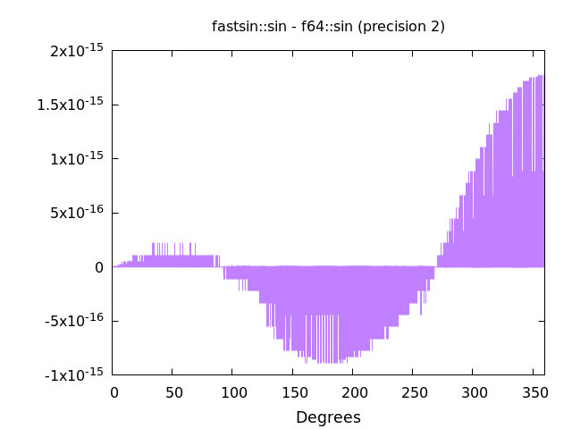
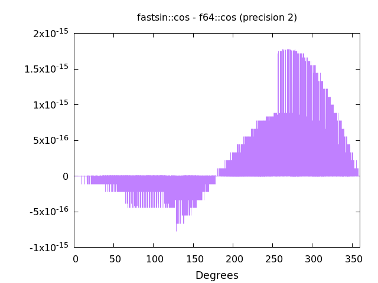

# fastsin
A rust library to calculate the sine and cosine *extremely* fast at the cost of a little bit of accuracy and memory.

# Safety
This library uses unsafe code, and **will access out-of-bounds memory if you input a angle that is not within 0-360**.
If you do want to input an angle outside of this range, you should use the `wsin` and `wcos` functions.

# Accuracy

As is visible here, the accuracy of this library is quite good for most applications.

# Speed
Below is a table of the time that the various functions take on my hardware (Ryzen 7-3700x. 3200MHz C16 memory)
You can test this on your own machine by cloning this repository and running `cargo bench`

Function | Time
--- | ---
FastSin::build | ~788 µs
FastSin::sin | ~587 ps (= 0.587 ns!!)
f64::sin | ~10.4 ns (= 10400 ps)
FastSin::cos | ~612 ps (= 0.612 ns!!)
f64::cos | ~10.4 ns (= 10400 ps)

As you can see, this library is about 17x faster than the standard implementations for cos and sin.

# Resources
A faster rounding implementation: https://stackoverflow.com/questions/17035464/a-fast-method-to-round-a-double-to-a-32-bit-int-explained
